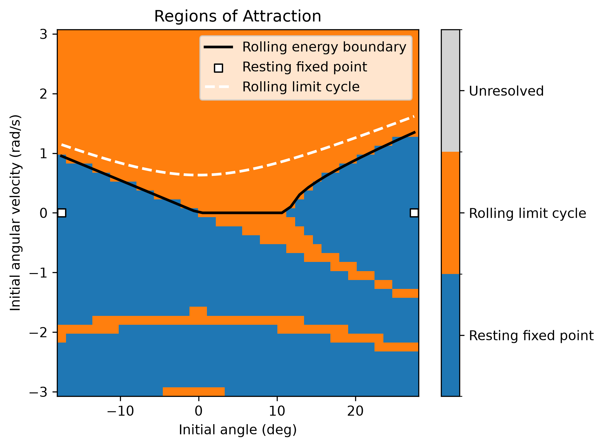
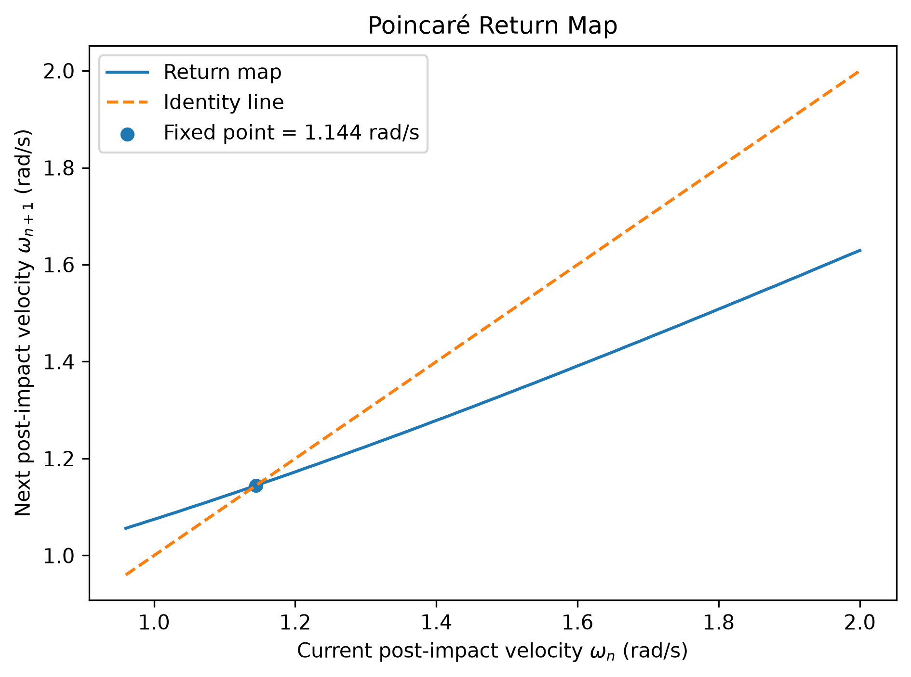
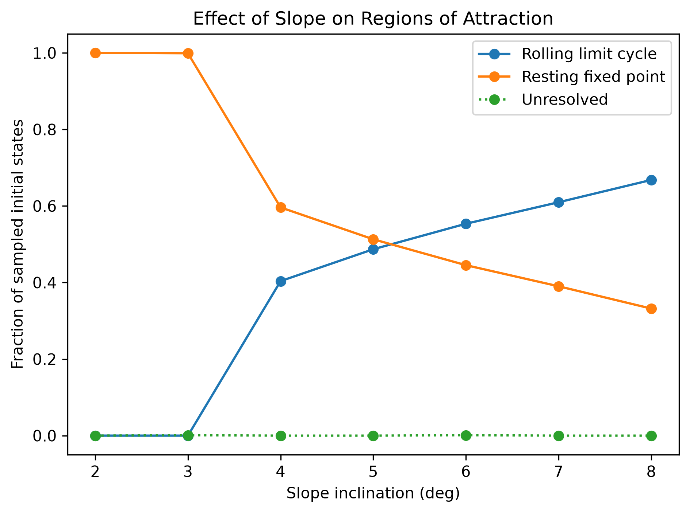
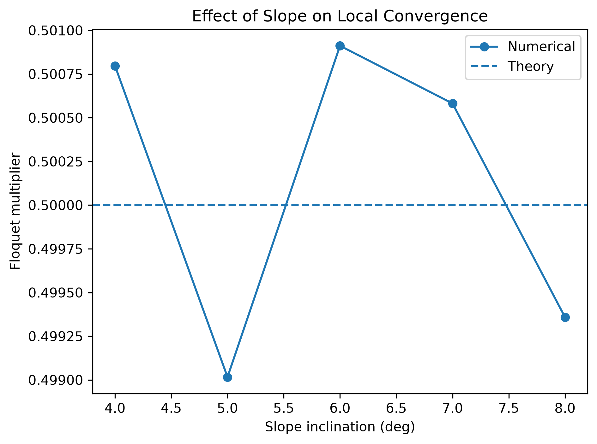
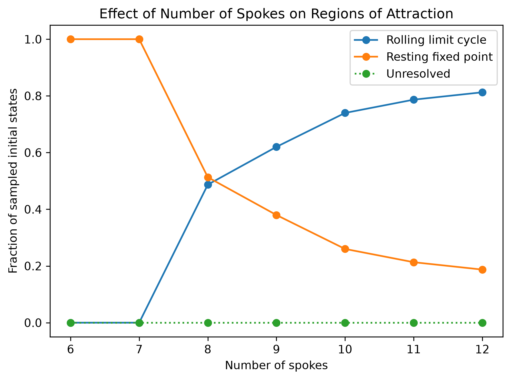
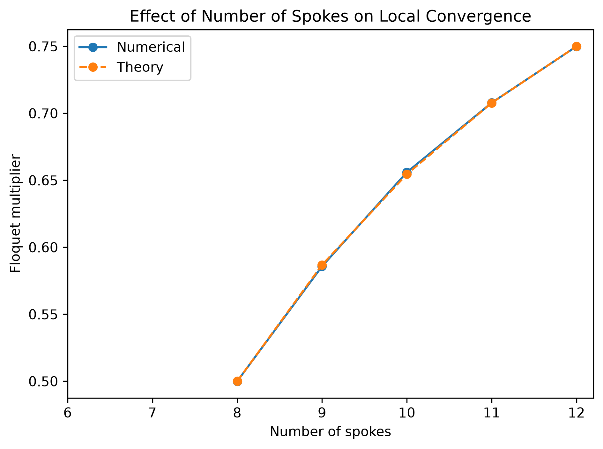

# Assignment 1: Rimless-Wheel Dynamics and Stability

## Reproducing the results

From the repository root, install the environment once:

```console
uv sync --python 3.14
```

Run the sanity checks:

```console
uv run python assignment_1_sanity_check.py
```

Run the experiments:

```console
uv run python assignment_1.py --experiment initial
uv run python assignment_1.py --experiment roa
uv run python assignment_1.py --experiment return_map
uv run python assignment_1.py --experiment slope_sweep
uv run python assignment_1.py --experiment spoke_sweep
```

## Model implementation

The wheel has $N$ massless spokes of length $l$ and a point mass at the hub. The half-angle between adjacent spokes is

$$
\alpha=\frac{\pi}{N}.
$$

The state is $x=[\theta,\dot\theta]$, where $\theta$ is measured from the upward vertical and is positive downhill. During a swing,

$$
\dot x=
\begin{bmatrix}
\dot\theta\\
\dfrac{g}{l}\sin\theta
\end{bmatrix}.
$$

At a forward impact,

$$
\theta^-=\gamma+\alpha,
\qquad
\theta^+=\gamma-\alpha,
\qquad
\dot\theta^+=\dot\theta^-\cos(2\alpha).
$$

The backward impact is also implemented so that states with negative angular velocity can be classified.

| Parameter | Value |
|---|---:|
| Gravity, $g$ | $9.81\ \mathrm{m/s^2}$ |
| Spoke length, $l$ | $1.0\ \mathrm{m}$ |
| Number of spokes, $N$ | 8 |
| Slope, $\gamma$ | $5^\circ$ |
| Half inter-spoke angle, $\alpha$ | $22.5^\circ$ |

## Sanity checks

The sanity checks test the geometry, continuous dynamics, event guards, and collision resets.

| Check | Expected result | Observed result |
|---|---|---|
| Geometry for $N=8$ | $\alpha=\pi/8=22.5^\circ$ | $22.5^\circ$ |
| Dynamics at $[\theta,\dot\theta]=[0.1,0]$ | $[0,9.81\sin(0.1)]\approx[0,0.97937]$ | $[0,0.97937]$ |
| Forward guard below contact | No impact at $20^\circ$ | `False` |
| Forward guard at contact | Impact at $\gamma+\alpha=27.5^\circ$ | `True` |
| Forward reset from $\dot\theta^-=2$ | $\theta^+=-17.5^\circ$, $\dot\theta^+=1.41421$ | $-17.5^\circ,1.41421$ |
| Backward reset from $\dot\theta^-=-2$ | $\theta^+=27.5^\circ$, $\dot\theta^+=-1.41421$ | $27.5^\circ,-1.41421$ |

All checks matched the expected values.

## Regions of attraction

I sampled a $41\times41$ grid over

$$
\theta\in[\gamma-\alpha,\gamma+\alpha],
\qquad
\dot\theta\in[-3,3]\ \mathrm{rad/s}.
$$

Each initial condition was simulated with RK4 using $\Delta t=10^{-3}\ \mathrm{s}$ for at most 40 s. A trajectory completing 20 consecutive forward impacts was classified as converging to the rolling limit cycle. If collision losses left insufficient energy to pass the upright configuration, it was classified as converging to the stable two-spoke resting configuration. A third label was used for unresolved cases.



For the default parameters:

| Attractor | Fraction |
|---|---:|
| Resting fixed point | 0.51695 |
| Rolling limit cycle | 0.48305 |
| Unresolved | 0.00000 |

The square markers represent the same resting contact configuration in two reduced-coordinate forms. The white dashed curve is the rolling hybrid limit cycle. For positive initial velocity, the numerical basin boundary agrees with the energy-based boundary. Negative initial velocities form several bands because the wheel may take different numbers of uphill steps before settling or reversing into downhill rolling.

## Poincaré return map and Floquet multiplier

I used the post-impact state $\theta=\gamma-\alpha$ as the Poincaré section and mapped the current post-impact angular velocity to the next one. The map used 151 velocities from 0.5 to 2.0 rad/s with $\Delta t=10^{-4}\ \mathrm{s}$.



The fixed point is

$$
\dot\theta^*=1.14422\ \mathrm{rad/s}.
$$

The theoretical value from swing energy conservation and the impact reset is $1.14402\ \mathrm{rad/s}$.

Using perturbations of $\pm0.01\ \mathrm{rad/s}$ around the fixed point with $\Delta t=10^{-5}\ \mathrm{s}$,

$$
\lambda\approx
\frac{P(\dot\theta^*+0.01)-P(\dot\theta^*-0.01)}{0.02}
=0.49929.
$$

$\lambda$ is similar to the slope of the blue return map at the intersection point.

The theoretical multiplier is

$$
\lambda_{\mathrm{theory}}=\cos^2(2\alpha)=0.5.
$$

Since $|\lambda|<1$, the rolling limit cycle is locally stable.

## Effect of slope

I swept the slope from $2^\circ$ to $8^\circ$ with $N=8$.

| Slope | Rolling RoA | Resting RoA | Unresolved | Fixed-point speed (rad/s) | Floquet multiplier |
|---:|---:|---:|---:|---:|---:|
| $2^\circ$ | 0.0000 | 1.0000 | 0.0000 | none | none |
| $3^\circ$ | 0.0000 | 0.9990 | 0.0010 | none | none |
| $4^\circ$ | 0.4037 | 0.5963 | 0.0000 | 1.0239 | 0.5008 |
| $5^\circ$ | 0.4870 | 0.5130 | 0.0000 | 1.1442 | 0.4990 |
| $6^\circ$ | 0.5536 | 0.4454 | 0.0010 | 1.2531 | 0.5009 |
| $7^\circ$ | 0.6098 | 0.3902 | 0.0000 | 1.3533 | 0.5006 |
| $8^\circ$ | 0.6681 | 0.3319 | 0.0000 | 1.4459 | 0.4994 |

| Regions of attraction | Local convergence |
|---|---|
|  |  |

The theoretical onset of sustained rolling is about $3.91^\circ$, consistent with the absence of a rolling cycle at $2^\circ$ and $3^\circ$. As slope increases, the rolling basin and fixed-point speed increase.

The Floquet multiplier stays near 0.5 because $\cos^2(2\alpha)$ is independent of slope for fixed $N$. The maximum numerical deviation from theory was below $9.9\times10^{-4}$. The unresolved cases at $3^\circ$ and $6^\circ$ are single grid points at the unstable upright equilibrium $(\theta,\dot\theta)=(0,0)$.

## Effect of the number of spokes

I swept $N=6$ through $12$ at a fixed $5^\circ$ slope.

| Spokes | Rolling RoA | Resting RoA | Fixed-point speed (rad/s) | Numerical / theoretical Floquet |
|---:|---:|---:|---:|---:|
| 6 | 0.0000 | 1.0000 | none | none |
| 7 | 0.0000 | 1.0000 | none | none |
| 8 | 0.4870 | 0.5130 | 1.1445 | 0.5000 / 0.5000 |
| 9 | 0.6202 | 0.3798 | 1.2894 | 0.5858 / 0.5868 |
| 10 | 0.7399 | 0.2601 | 1.4151 | 0.6560 / 0.6545 |
| 11 | 0.7867 | 0.2133 | 1.5276 | 0.7079 / 0.7077 |
| 12 | 0.8127 | 0.1873 | 1.6305 | 0.7499 / 0.7500 |

| Regions of attraction | Local convergence |
|---|---|
|  |  |

At a $5^\circ$ slope, $N=6$ and $N=7$ do not sustain the rolling cycle. From $N=8$ onward, increasing the spoke count reduces the angle between spokes and the energy lost at impact, so the rolling basin grows.

The Floquet multiplier increases from about 0.5 at $N=8$ to 0.75 at $N=12$, so local convergence per step becomes slower as $N$ increases. The numerical values closely follow $\cos^2(2\pi/N)$, with a maximum absolute error of about $1.5\times10^{-3}$.

## Conclusions

The default wheel has two stable long-term behaviors: a two-spoke resting configuration and a downhill rolling limit cycle. Increasing slope or spoke count enlarges the rolling basin. Slope mainly changes the rolling speed, while spoke count also changes the local convergence rate through the Floquet multiplier.
